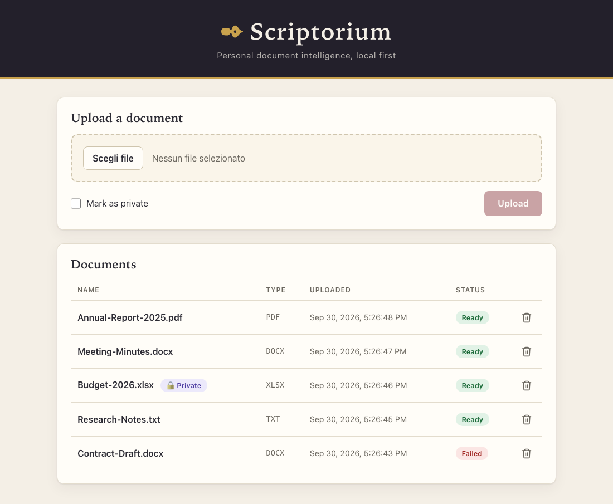

<div align="center">

# ✒ Scriptorium

**Personal document intelligence — local first.**

Upload your documents, keep them on your own machine, and let them become
something you can question, summarize and mine for entities.


<picture>
  <source media="(prefers-color-scheme: dark)" srcset="docs/images/screenshot-dark.png">
  
</picture>

</div>

---

## ✨ What it does today

- 📄 **Upload** PDF, Word (`.docx`), Excel (`.xlsx`) and plain-text (`.txt`) files, up to 50 MB (configurable).
- ⚙️ **Extracts the text in the background.** Every document moves from *processing* to *ready*,
  or to *failed* with a human-readable reason (encrypted PDF, corrupted file, no extractable text…).
- 🗂 **Keeps the original and the text apart:** the file stays on disk, the extracted text lives in the database.
- 🔒 **Private flag** per document. It is stored now and will force the local model once routing exists.
- ♻️ **Rejects duplicates** by content (SHA-256), even when the file was renamed, and tells you which document it matches.
- 🗑 **Deletes documents** (record, extracted text and file) with a confirmation in the row.
- 📊 **Live list** that refreshes while documents are processing, with a progress bar during upload,
  clear error messages, and a dark theme that follows your system.

## 🗺 Roadmap

| | Feature | Status |
|---|---|---|
| ✅ | Document upload and parsing | Done |
| ⬜ | Ask questions about a document | Planned |
| ⬜ | Summaries | Planned |
| ⬜ | Entity extraction | Planned |
| ⬜ | Model router: private documents → local **Ollama**, complex tasks → **Claude API**, manual override | Planned |
| ⬜ | Docker Compose setup (with an Ollama service) | Planned |

Scriptorium is single-user and local-first: no authentication, no multi-tenancy, no cloud storage.

## 🚀 Getting started

**Prerequisites:** the [.NET 10 SDK](https://dotnet.microsoft.com/download) and Node.js 20 or 22 (LTS) with npm.

```bash
git clone https://github.com/maurytam/scriptorium.git
cd scriptorium

# 1. API — http://localhost:5034
dotnet run --project src/Scriptorium.API

# 2. Web UI, in a second terminal — http://localhost:4200
cd src/Scriptorium.Web
npm install
npm start
```

Open <http://localhost:4200>. The dev server proxies `/api` to the API, and the database is
created and migrated automatically on first start.

## ⚙️ Configuration

Settings live in [`src/Scriptorium.API/appsettings.json`](src/Scriptorium.API/appsettings.json).
Relative paths are resolved from the API project folder, and `App_Data/` is git-ignored.

| Key | Default | Meaning |
|---|---|---|
| `ConnectionStrings:Default` | `Data Source=App_Data/scriptorium.db` | SQLite database file |
| `Storage:LocalPath` | `App_Data/documents` | Where the original uploads are kept |
| `Documents:MaxSizeBytes` | `52428800` (50 MB) | Largest accepted upload |

## 🔌 API

| Method | Endpoint | Description |
|---|---|---|
| `POST` | `/api/documents` | Upload a file (`multipart/form-data`: `file`, optional `isPrivate`). `202`, or `400` unsupported type, `409` duplicate, `413` too large |
| `GET` | `/api/documents` | List documents, newest first |
| `GET` | `/api/documents/{id}` | Metadata and, if it failed, the reason |
| `GET` | `/api/documents/{id}/text` | Extracted text (`409` until the document is ready) |
| `DELETE` | `/api/documents/{id}` | Delete a document (`409` while it is still processing) |
| `GET` | `/api/documents/limits` | Upload limits enforced by the server |

The full contract is in [`specs/001-document-upload-parsing/contracts/documents-api.md`](specs/001-document-upload-parsing/contracts/documents-api.md).

## 🧱 Architecture

```
src/
├── Scriptorium.Core/             entities, interfaces, DTOs, services, Result<T> — no infrastructure dependencies
├── Scriptorium.Infrastructure/   PdfPig and OpenXML parsers, EF Core + SQLite, file store, background queue
├── Scriptorium.API/              ASP.NET Core minimal API
└── Scriptorium.Web/              Angular UI
tests/
├── Scriptorium.Core.Tests/
└── Scriptorium.Infrastructure.Tests/   unit tests and in-process API integration tests
specs/                            specification, plan, contracts and task list
```

- **Clean Architecture:** `Core` depends on nothing; everything else goes through interfaces defined there.
- **Errors as values:** failures travel as `Result<T>` instead of exceptions across layer boundaries.
- **Off the request thread:** parsing runs in a background queue, so a large file never blocks the API.
- **Local storage:** originals on disk, metadata and extracted text in SQLite.

## 🧪 Tests

```bash
dotnet test                                   # unit and integration tests

cd src/Scriptorium.Web
npx ng test --watch=false --browsers=ChromeHeadless   # Angular specs (needs Chrome)
```

The integration tests start the API in-process against a throwaway database and folder.

## 🤝 Development

Work is spec-driven: each feature starts from the documents in [`specs/`](specs/), is built on a
feature branch and merged through a pull request. Conventions are in [`Claude.md`](Claude.md).

## 📜 License

Released under the [MIT License](LICENSE).
